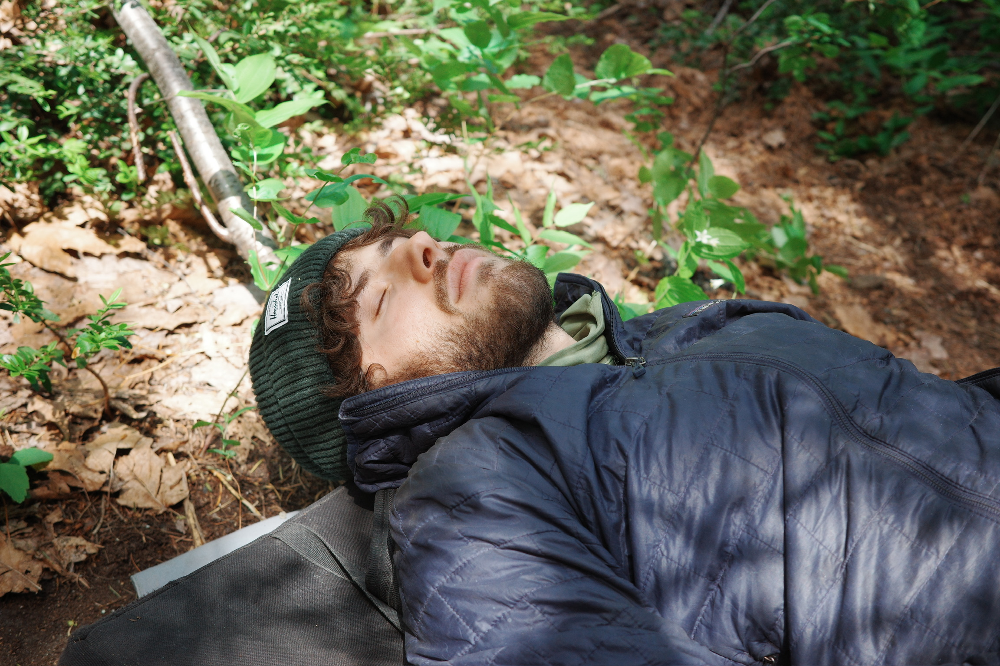
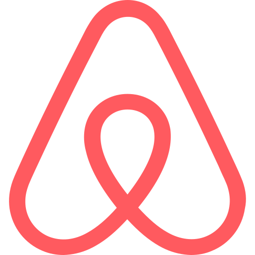
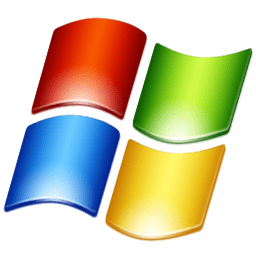

Hi, I'm Chris. 

napping, circa 2025

I'm a software engineer interested in developer tools and code aesthetics. I've done some occasional research as well. 

I've previously worked at <a href="https://dagster.io" target="_blank" rel="noopener noreferrer">Dagster</a>, <a href="https://chronon.ai" target="_blank" rel="noopener noreferrer">Airbnb</a>, <a href="https://facebook.com" target="_blank" rel="noopener noreferrer">Facebook</a>, and <a href="https://microsoft.com" target="_blank" rel="noopener noreferrer">Microsoft</a>.      

Outside of work, I'm a lifelong jazz guitar player and outdoorsman.
